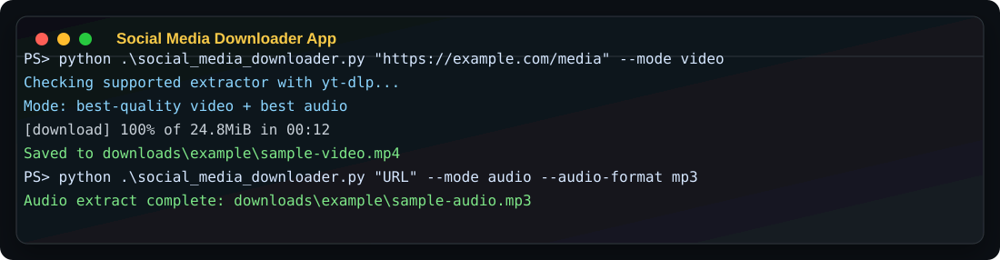

#######################################################################
# Author: Lehlohonolo Adolf Matobakele  
# Email: lehlohonolo.matobakele@gov.ls
# Contacxt: 00266 62320704
#######################################################################
# Social Media Downloader App

Python CLI for downloading a user-provided media link as either best-quality video or best-quality audio.

It uses `yt-dlp`, which supports thousands of media sites and is commonly used for YouTube, TikTok, Instagram, Facebook, Twitter/X, and many others. Site support can change whenever platforms change their pages or access rules, so keep `yt-dlp` updated.

Use this only for media you own, have permission to download, or may lawfully save. This app does not bypass DRM.

## Screenshot



## Setup

```powershell
python -m venv .venv
.\.venv\Scripts\Activate.ps1
python -m pip install -r requirements.txt
```

For YouTube, keep `yt-dlp` fresh. If you see `HTTP Error 403`, `n challenge`, or age-restriction messages, update with:

```powershell
python -m pip install --upgrade -r requirements.txt
python -m pip install --upgrade yt-dlp
```

## Interactive Use

Run the app, paste the link, then choose whether to download one item or the full playlist when the link looks like a playlist. Then choose `audio` or `video`.

For video, the app asks for a quality such as `1080`, `720`, `480`, or `best`. For audio, the app asks for the output format and defaults to `mp3`.

```powershell
python .\social_media_downloader.py
```

## Download Video

```powershell
python .\social_media_downloader.py "https://example.com/media-link" --mode video
```

The video mode asks which quality you want before download. By default, interactive use chooses up to `1080p` instead of always downloading the largest possible file.

Download up to 720p:

```powershell
python .\social_media_downloader.py "https://example.com/media-link" --mode video --video-quality 720
```

Force the original best-quality behavior:

```powershell
python .\social_media_downloader.py "https://example.com/media-link" --mode video --video-quality best
```

Force a common container:

```powershell
python .\social_media_downloader.py "https://example.com/media-link" --mode video --video-container mp4
```

## Download Audio

Best native audio:

```powershell
python .\social_media_downloader.py "https://example.com/media-link" --mode audio --audio-format best
```

Convert to MP3:

```powershell
python .\social_media_downloader.py "https://example.com/media-link" --mode audio --audio-format mp3
```

In interactive mode, audio defaults to `mp3` so YouTube/YouTube Music downloads do not surprise you with `.opus` unless you choose `opus` or `best`.

Audio downloads embed available title, artist, album/date metadata, and cover art by default. Playlist audio filenames also use music-friendly fields when the site exposes them:

```text
001 - Artist Name - Song Title [video_id].mp3
```

If the site only exposes weak metadata, such as titles named `1`, `2`, or `3`, the downloader cannot invent the real song title. In that case, try the same playlist with logged-in cookies:

```powershell
python .\social_media_downloader.py "https://www.youtube.com/playlist?list=PLAYLIST_ID" --mode audio --playlist-mode playlist --audio-format mp3 --cookies-from-browser chrome
```

To also keep the thumbnail image as a separate file next to the MP3:

```powershell
python .\social_media_downloader.py "https://example.com/media-link" --mode audio --audio-format mp3 --write-thumbnail
```

To disable audio tagging or cover-art embedding:

```powershell
python .\social_media_downloader.py "https://example.com/media-link" --mode audio --no-embed-metadata --no-embed-thumbnail
```

## Download One Song Or A Full Playlist

Interactive mode asks when the URL looks like a YouTube playlist, channel, or other multi-item link:

```powershell
python .\social_media_downloader.py
```

For one song/video only:

```powershell
python .\social_media_downloader.py "https://www.youtube.com/watch?v=VIDEO_ID&list=PLAYLIST_ID" --mode audio --playlist-mode single --audio-format mp3
```

For the full playlist:

```powershell
python .\social_media_downloader.py "https://www.youtube.com/playlist?list=PLAYLIST_ID" --mode audio --playlist-mode playlist --audio-format mp3
```

Playlist mode skips unavailable, deleted, or private items by default so one bad item does not stop the whole download.

If YouTube says something like `Downloading 156 items of 299`, the app is not limiting the playlist to 156. That means YouTube reported 299 playlist slots, but `yt-dlp` could only see 156 unique/downloadable entries in the current session. The missing entries are usually private, deleted, repeated duplicates, region blocked, age restricted, hidden, or only visible to a logged-in account.

To explicitly request the whole visible range:

```powershell
python .\social_media_downloader.py "https://www.youtube.com/playlist?list=PLAYLIST_ID" --mode audio --playlist-mode playlist --audio-format mp3 --playlist-items 1-299
```

If you can play the missing songs in your browser, try using your logged-in browser cookies:

```powershell
python .\social_media_downloader.py "https://www.youtube.com/playlist?list=PLAYLIST_ID" --mode audio --playlist-mode playlist --audio-format mp3 --playlist-items 1-299 --cookies-from-browser chrome
```

You can also retry only the second part of a playlist:

```powershell
python .\social_media_downloader.py "https://www.youtube.com/playlist?list=PLAYLIST_ID" --mode audio --playlist-mode playlist --audio-format mp3 --playlist-items 157-299
```

If you want the download to stop as soon as one playlist item fails:

```powershell
python .\social_media_downloader.py "https://www.youtube.com/playlist?list=PLAYLIST_ID" --mode audio --playlist-mode playlist --audio-format mp3 --stop-on-error
```

For a video playlist capped at 720p:

```powershell
python .\social_media_downloader.py "https://www.youtube.com/playlist?list=PLAYLIST_ID" --mode video --playlist-mode playlist --video-quality 720
```

`--allow-playlist` still works and is the same as choosing `--playlist-mode playlist`.

## Output Folder

```powershell
python .\social_media_downloader.py "https://example.com/media-link" --mode video --output-dir .\downloads
```

By default, downloads are saved in per-site folders under `downloads`.

## Login-Gated Media

Some TikTok, Instagram, Facebook, Twitter/X, or age/private YouTube links may require cookies from a browser session. Export a Netscape-format `cookies.txt` file and pass it like this:

```powershell
python .\social_media_downloader.py "https://example.com/private-link" --mode video --cookies .\cookies.txt
```

Or let `yt-dlp` read cookies directly from an installed browser:

```powershell
python .\social_media_downloader.py "https://example.com/private-link" --mode video --cookies-from-browser chrome
```

Do not commit cookies or secrets. The `.gitignore` excludes common cookie filenames.

## YouTube 403, Age Checks, Or N-Challenge Errors

If YouTube starts writing thumbnails but every audio/video download fails with `HTTP Error 403: Forbidden`, the metadata and thumbnail side is working, but YouTube is blocking the actual media file request.

Use your logged-in browser cookies:

```powershell
python .\social_media_downloader.py "https://www.youtube.com/watch?v=VIDEO_ID&list=PLAYLIST_ID" --mode audio --playlist-mode playlist --audio-format mp3 --cookies-from-browser chrome
```

The app now enables YouTube JavaScript challenge helpers automatically when a Node/Deno runtime is installed. You can choose a runtime manually:

```powershell
python .\social_media_downloader.py "URL" --mode audio --youtube-js-runtime node
```

Or disable those helpers:

```powershell
python .\social_media_downloader.py "URL" --mode audio --youtube-js-runtime none --no-youtube-remote-components
```

If interactive mode asks whether to use browser cookies, choose the browser where you are signed into YouTube, such as `chrome` or `edge`.

## Useful Options

```powershell
python .\social_media_downloader.py "URL" --mode video --write-info-json --write-thumbnail
python .\social_media_downloader.py "URL" --mode audio --download-archive .\downloaded.txt
python .\social_media_downloader.py "URL" --mode video --playlist-mode playlist
python .\social_media_downloader.py "URL" --mode video --video-quality 480
python .\social_media_downloader.py "URL" --mode audio --audio-format mp3
python .\social_media_downloader.py "URL" --mode audio --audio-format mp3 --write-thumbnail
python .\social_media_downloader.py "URL" --mode audio --playlist-mode playlist --stop-on-error
python .\social_media_downloader.py "URL" --mode audio --playlist-mode playlist --playlist-items 1-299 --cookies-from-browser chrome
python .\social_media_downloader.py "URL" --mode audio --playlist-mode playlist --cookies-from-browser edge --youtube-js-runtime node
```

Playlist URLs default to asking in interactive use. In non-interactive use, pass `--playlist-mode single` or `--playlist-mode playlist` to make the choice explicit.

If YouTube or another site fails with a local certificate verification error, first try updating `yt-dlp` and your Python certificates. As a last resort, you can pass:

```powershell
python .\social_media_downloader.py "URL" --mode audio --no-check-certificate
```

## Notes

- Install updates with `python -m pip install --upgrade yt-dlp`.
- Some platforms block downloads, change frequently, or require login cookies.
- Downloading copyrighted or private media without permission may violate law or platform terms.
- `imageio-ffmpeg` is included so merging video/audio and audio extraction can work without a separate FFmpeg install in many environments.

Official docs used:

- [yt-dlp GitHub repository](https://github.com/yt-dlp/yt-dlp)
- [Embedding yt-dlp in Python](https://yt-dlp-yt-dlp.mintlify.app/advanced/embedding)

